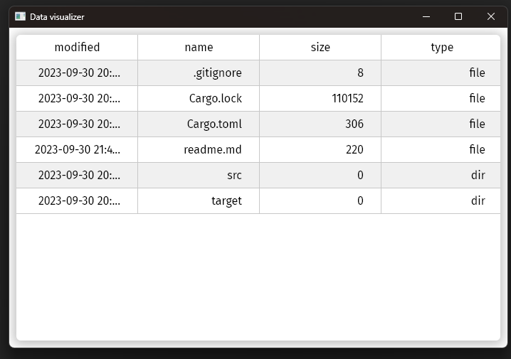

# freya-visualizer 🔍

Quickly visualize JSON data in a GUI table. Made using [Freya](https://github.com/marc2332/freya) 🦀.

## Features
- [x] JSON
- [ ] YAML
- [ ] Other formats
- [ ] Sorting

## Usage

With [Nushell](https://www.nushell.sh/):
```sh
ls | to json | .\target\debug\freya-visualizer.exe
# Adapt the binary name to your platform
```



